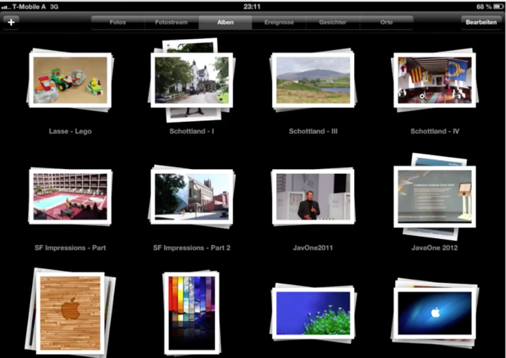
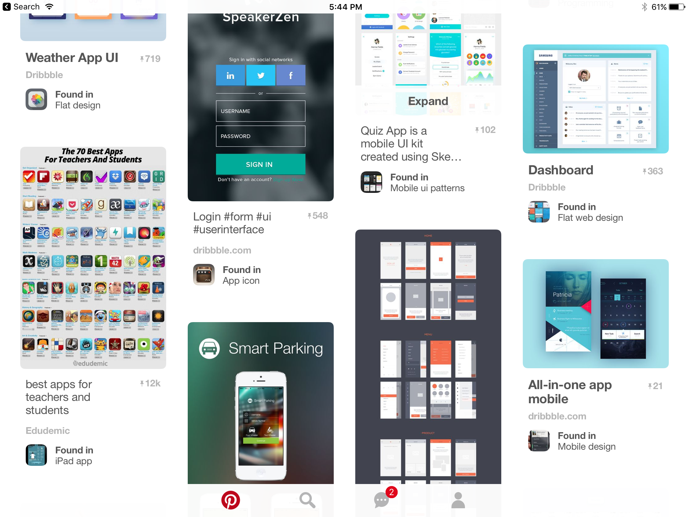
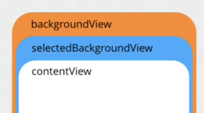
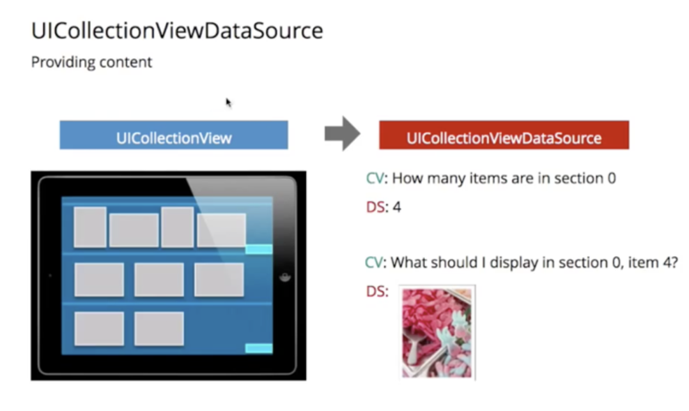
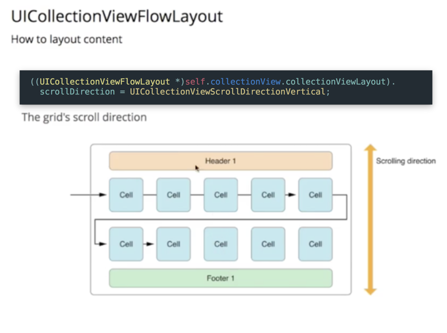
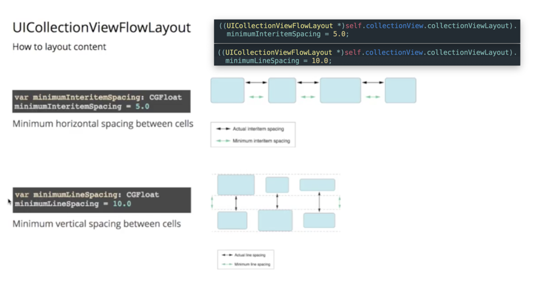
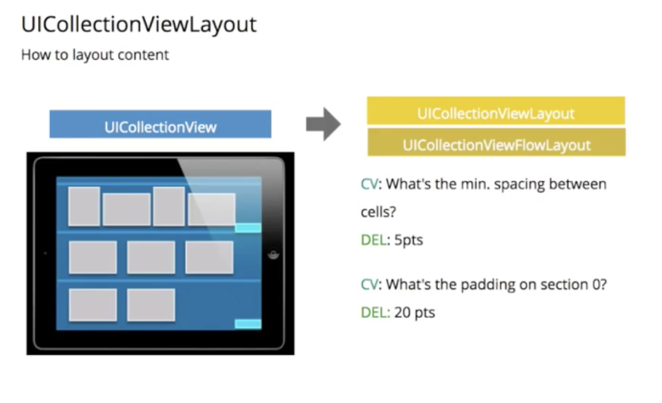
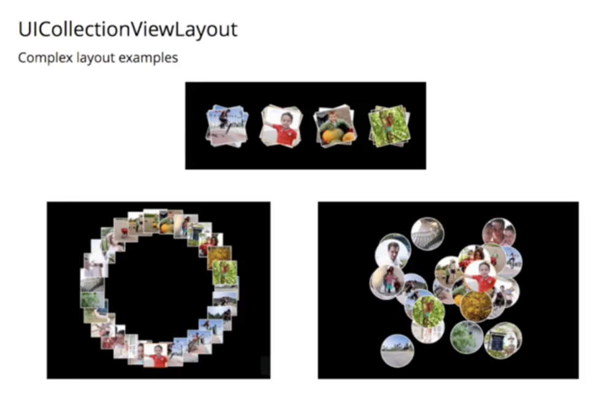

autoscale: true 
build-lists: true

# [fit]UICollectionView

---

# [fit]What is a UICollectionView?

- Way to present ordered data with a flexible layout

- Grid layout is the most commonly used

---



---


---



---

## [fit]50,000 Foot View


--- 


---

## [fit]UICollectionViewCell
* Cells are the content (add content to `contentView`)



---

* Supplementary view are things like headers and footers

* DecorationView is the background image in this case

---
## [fit]UICollectionViewDataSource



--- 
## [fit]UICollectionViewDataSource 3 Required Methods

```swift

// you should implement this and return the number of sections in your collection

- (NSInteger)numberOfSectionsInCollectionView:(UICollectionView *)collectionView;

// you have to determine the number of items there are for each section and return it here
- (NSInteger)numberOfItemsInSection:(NSInteger)section;


// this is where the model and view intersect
- (UICollectionViewCell *)cellForItemAtIndexPath:(NSIndexPath *)indexPath;

```

---

##  [fit]UICollectionViewDelegate


```objc

- (void)collectionView:(UICollectionView *)collectionView didSelectItemAtIndexPath:(NSIndexPath *)indexPath;

```
---
## [fit]UICollectionViewFlowLayout

- Subclass of `UICollectionViewLayout`.

- Used for most grid style layouts.

- The default flow layout is automatically hooked up in the *UICollectionViewController *and can be accessed using the *collectionViewLayout *property.

- What is the difference between a collectionview added as a subview in a UIViewController and a `UICollectionViewController`? (Make sure you understand this)

- If you have an outlet to a *UICollectionView* then you can also access the *collectionViewLayout *which is automatically hooked up in IB.

---

## [fit]UICollectionViewFlowLayout

- You can setup static values for the flowlayout in the storyboard. 

- 🎗 static default flowlayout values automatically set in storyboard may affect your layout & give you results you aren't expecting.

- Storyboard is a good place to look to see what properties the layout has. Experiment.

- To setup values that are *relative* to the view's dimensions use *viewDidLoad*. (Setting up flow layout dimensions in storyboard does not allow us to make our layout relative to the current screen size).

---



---

```objc


// some property definitions
@property (nonatomic) CGFloat minimumInteritemSpacing;
@property (nonatomic) CGFloat minimumLineSpacing;
@property (nonatomic) UICollectionViewScrollDirection scrollDirection;

// E.g.

UICollectionViewFlowLayout* layout = (UICollectionViewFlowLayout*)self.collectionView.collectionViewLayout;
layout.minimumLineSpacing = 10;


```

---



---


---

## [fit] UICollectionViewDelegateFlowLayout*


- You can also setup a delegate to create dynamically sized cells using `UICollectionViewDelegateFlowLayout`.

```objc

- (CGSize)collectionView:(UICollectionView *)collectionView layout:(UICollectionViewLayout *)collectionViewLayout sizeForItemAtIndexPath:(NSIndexPath *)indexPath;

```

---



--- 



<https://github.com/philosopherdog/iOS-W3D3-CollectionViews>

